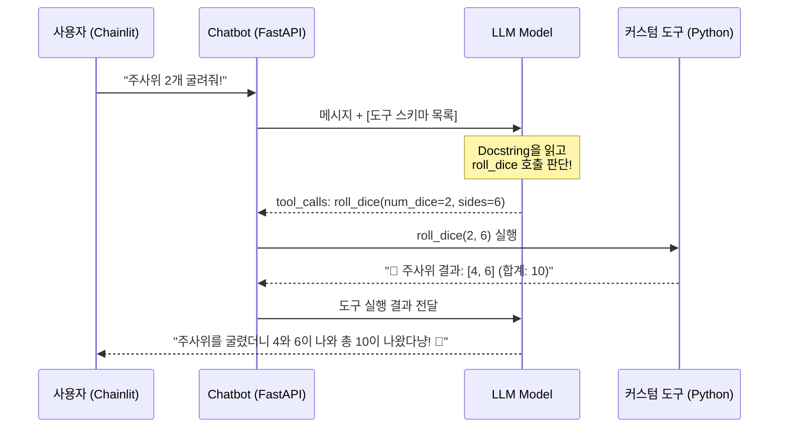

# 🎯 Mission 01: Chatbot에게 나만의 커스텀 도구(Custom Tool) 추가하고 UI에서 호출 검증하기

에이전트는 LLM에 **도구(Tools)**라는 손발을 쥐어줄 때 진정한 에이전트로 거듭납니다.  
LLM은 자체 연산이나 실시간 외부 상호작용 능력이 없지만, 하네스를 통해 도구를 쥐어주면 필요한 시점에 스스로 판단하여 함수를 호출(Tool Call)합니다.

본 미션에서는 교육생 여러분이 직접 파이썬 함수로 **나만의 커스텀 도구**를 만들고, 이를 `chatbot` 에이전트에 등록하여 Chainlit UI에서 대화를 통해 도구가 정상 호출되는 전체 사이클을 실습합니다.

---

## 📂 실습 대상 파일 안내

| 파일 경로 | 역할 | 실습 내용 |
| :--- | :--- | :--- |
| `app/tools/custom_tools.py` | 커스텀 도구 정의 | `@tool(parse_docstring=True)` 데코레이터를 사용하여 원하는 도구 함수 구현 |
| `app/agents/chatbot.py` | 에이전트 팩토리 | 작성한 커스텀 도구를 임포트하고 `active_tools` 목록에 결합 |

---

## 💡 핵심 원리: LLM은 도구를 어떻게 인식할까?

LangChain의 `@tool(parse_docstring=True)` 데코레이터는 파이썬 함수의 내부 구현 코드를 모델에게 보내는 것이 아니라, 함수의 **① 이름**, **② Docstring(설명문)**, **③ 인자(Arguments) 타입과 설명**을 파싱하여 아래와 같은 **도구 스키마(Tool Schema JSON)**로 자동 변환합니다.



> [!IMPORTANT]
> **Docstring이 도구의 품질을 결정합니다!**  
> 시스템 프롬프트를 번거롭게 수정하지 않아도, 함수의 Docstring에 *"사용자가 주사위나 난수 추첨을 요청할 때 반드시 이 도구를 호출하세요."*와 같이 **명확한 호출 조건(Trigger Rule)**을 적어두면 LLM이 알아서 적절한 시점에 도구를 실행합니다.

---

## 🛠️ 실습 단계별 수행 가이드

### 1단계: `app/tools/custom_tools.py`에 커스텀 도구 작성하기

`app/tools/custom_tools.py` 파일을 열고, 원하는 도구를 작성합니다.  
아래 2가지 예시 중 하나를 선택하거나, 완전히 새로운 도구(예: 로또 번호 추첨, 코인 던지기 등)를 작성해도 좋습니다.

```python
# app/tools/custom_tools.py
import random
from langchain_core.tools import tool

@tool(parse_docstring=True)
def roll_dice(num_dice: int = 1, sides: int = 6) -> str:
    """지정된 개수와 면을 가진 주사위를 굴려 무작위 결과를 반환합니다.
    
    사용자가 주사위 굴리기, 게임 승패 결정, 난수 생성, 무작위 번호 뽑기를 요청할 때 반드시 호출하세요.

    Args:
        num_dice: 굴릴 주사위 개수 (기본값: 1, 최대: 10)
        sides: 주사위의 면 수 (기본값: 6, 예: 6, 12, 20)
    """
    num_dice = max(1, min(num_dice, 10))
    rolls = [random.randint(1, sides) for _ in range(num_dice)]
    total = sum(rolls)
    return f"🎲 주사위 {num_dice}개(d{sides}) 결과: {rolls} (합계: {total})"


@tool(parse_docstring=True)
def convert_currency(amount: float, from_currency: str = "USD", to_currency: str = "KRW") -> str:
    """주요 국가 통화 간의 환율을 계산하여 환전 금액을 반환합니다.
    
    사용자가 달러, 유로, 엔화, 원화 등의 환율 조회나 환전 계산을 요청할 때 반드시 호출하세요.

    Args:
        amount: 환전할 금액
        from_currency: 기준 통화 코드 (USD, EUR, JPY, KRW)
        to_currency: 대상 통화 코드 (기본값: KRW)
    """
    # 모의 고정 환율 데이터 (실전에서는 외부 환율 API 연동 가능)
    rates_to_krw = {
        "USD": 1380.0,
        "EUR": 1500.0,
        "JPY": 9.2,    # 1엔당 원화
        "KRW": 1.0
    }
    
    from_curr = from_currency.upper()
    to_curr = to_currency.upper()
    
    if from_curr not in rates_to_krw or to_curr not in rates_to_krw:
        return f"⚠️ 지원하지 않는 통화입니다. 지원 목록: {list(rates_to_krw.keys())}"
        
    # 원화 기준으로 환산 후 대상 통화로 변환
    in_krw = amount * rates_to_krw[from_curr]
    result = in_krw / rates_to_krw[to_curr]
    
    return f"💱 환율 계산: {amount:,.2f} {from_curr} = {result:,.2f} {to_curr} (기준환율: 1 {from_curr}당 {rates_to_krw[from_curr]}원)"
```

---

### 2단계: `app/agents/chatbot.py`에 도구 바인딩하기

`app/agents/chatbot.py` 파일을 열고, 방금 작성한 도구를 임포트하여 `active_tools` 리스트에 등록합니다.

```python
# app/agents/chatbot.py 상단 임포트
from app.tools.custom_tools import roll_dice, convert_currency

# ... (생략) ...

async def create_agent_executor():
    # ... (생략) ...
    
    # ---------------------------------------------------------------------------
    # [Mission 01] 커스텀 도구 바인딩
    # ---------------------------------------------------------------------------
    active_tools = list(tools_chatbot) + [roll_dice, convert_currency]
    
    chatbot_agent = create_agent(
        model=llm,
        tools=active_tools,              # 👈 등록된 도구 목록 전달
        system_prompt=CHATBOT_SYSTEM_PROMPT,
        checkpointer=checkpointer,
        context_schema=AgentContext
    )
    return chatbot_agent
```

---

### 3단계: 자동화 검증 스크립트 실행 (`test_mission01.py`)

터미널에서 작성한 도구와 챗봇 바인딩이 올바르게 구현되었는지 테스트 스크립트로 검증합니다:

```bash
python tests/test_mission01.py
```

성공 시 아래와 같은 통과 메시지가 출력됩니다:
```text
✅ Test 1 통과: custom_tools.py 도구 정의 확인 (roll_dice, convert_currency)
✅ Test 2 통과: 각 도구의 단위 실행 및 결과 반환 확인
✅ Test 3 통과: chatbot 에이전트에 커스텀 도구 바인딩 확인 (총 12종)
🎉 [Mission 01] 커스텀 도구 구현 및 챗봇 결합 검증 100% 통과!
```

---

### 4단계: UI에서 도구 호출 대화 테스트 및 검증

1. GitHub Codespaces 터미널에서 FastAPI 서버를 재기동합니다:
   ```bash
   python app/server.py --port 8000
   ```
2. 웹 브라우저(`8080` 포트 창)의 Chainlit 대화방에서 도구 호출을 유도하는 질문을 던져봅니다.

#### 🧪 테스트 1: 주사위 도구 호출 유도
* **사용자 입력**: `심심한데 주사위 3개만 굴려줘!`
* **관찰 포인트**:
  - Chainlit UI에 **`roll_dice`** 도구 실행 스텝(Step)이 파란색/녹색 박스로 나타나는지 확인합니다.
  - LLM이 임의로 숫자를 지어내는(환각) 대신, 파이썬 함수가 반환한 실제 난수 리스트와 합계를 받아 고양이 말투로 대답하는지 확인합니다.

#### 🧪 테스트 2: 환율 계산 도구 호출 유도
* **사용자 입력**: `내가 미국 주식에 1500달러가 있는데 한국 돈으로 환산하면 대략 얼마 정도야?`
* **관찰 포인트**:
  - `convert_currency` 도구가 호출되며 `amount=1500, from_currency="USD", to_currency="KRW"` 인자가 정확히 전달되는지 확인합니다.
  - 도구의 계산 결과가 최종 고양이 답변에 자연스럽게 녹아드는지 확인합니다.

---

## 💡 트러블슈팅: LLM이 도구를 안 부르고 말로만 답할 때

만약 질문을 던졌는데 도구를 호출하지 않고 모델이 자체 지식으로 대충 둘러댄다면 아래 항목을 점검하세요:
1. **함수의 Docstring에 명확한 트리거 규칙이 있는가?**:
   - 나쁜 예: `"""주사위를 굴립니다."""`
   - 좋은 예: `"""지정된 개수의 주사위를 굴려 난수 결과를 반환합니다. 사용자가 주사위, 난수, 무작위 확률을 요구할 때 반드시 호출하세요."""`
2. **`chatbot.py`의 `active_tools`에 함수 객체가 제대로 추가되었는가?**:
   - `roll_dice()`처럼 괄호를 붙여 호출한 결과를 넣지 말고, 함수 이름인 `roll_dice` 객체 자체를 리스트에 넣어야 합니다.

---

## 🏆 Mission 01 완료 체크리스트

- [ ] `app/tools/custom_tools.py`에 `@tool` 데코레이터를 적용한 커스텀 함수를 1개 이상 작성했다.
- [ ] 함수의 Docstring에 목적, 사용 시점, 인자 설명이 명확하게 작성되었다.
- [ ] `app/agents/chatbot.py`의 `active_tools` 리스트에 커스텀 도구가 추가되었다.
- [ ] Chainlit UI에서 사용자의 자연어 요청에 따라 도구가 정상 호출되고 결과가 대화에 반영됨을 확인했다.
