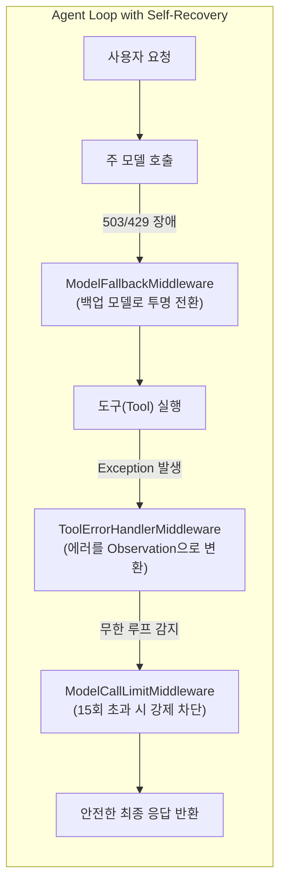

# 🎯 Mission 02: 메인 오케스트레이터 구축 — 자가 복구(Self-Recovery) & 서브에이전트(Sub-Agent) 위임

앞서 Mission 00과 01에서 우리는 단일 챗봇의 기본 하네스와 커스텀 도구 연결을 배웠습니다.  
하지만 실제 프로덕션 환경에서는 **LLM 통신 장애, 도구 실행 예외, 무한 루프** 같은 시스템 결함이 빈번하게 발생하며, 단일 에이전트에게 모든 도구를 쥐어주면 **컨텍스트 오염과 정보 불균형(Information Asymmetry)**으로 인해 에이전트가 길을 잃게 됩니다.

본 미션에서는 앞으로 우리 프로젝트의 중심이 될 **`main_agent.py` (메인 오케스트레이터)**를 구축합니다.  
에이전트 루프를 보호하는 **자가 복구(Self-Recovery) 미들웨어 3종**과, 전문 서브에이전트에게 작업을 위임하는 **오케스트레이션 도구**를 장착하고 검증합니다.

---

## 📂 실습 대상 파일 안내

| 파일 경로 | 역할 | 실습 내용 |
| :--- | :--- | :--- |
| `app/agents/main_agent.py` | 메인 에이전트 | 하네스 기능을 연결할 메인 오케스트레이터 (Self-Recovery & `tools_supervisor` 바인딩) |
| `tests/test_mission02.py` | 자동화 검증 스크립트 | 미들웨어 및 도구 장착 여부, 스모크 테스트 실행 |

---

## 💡 핵심 이론: 하네스가 에이전트를 보호하는 원리

### 1. Self-Recovery vs Self-Correction
* **Self-Correction (자가 수정)**: 모델 자신의 추론 오류를 프롬프트 재질문이나 비평(Critic)을 통해 **LLM 스스로** 고치는 것.
* **Self-Recovery (자가 복구)**: LLM의 개입 없이, **하네스(Middleware)가 시스템/도구 에러를 가로채어 투명하게 복구**하는 것.



* **`ModelFallbackMiddleware`**: 주 모델 API가 일시적으로 먹통이 되면 지수 백오프 재시도 후 백업 모델(`gemini-2.5-flash` 등)로 자동 failover합니다.
* **`ToolErrorHandlerMiddleware`**: 도구가 `raise Exception`을 일으켜도 전체 서버가 크래시되지 않도록 에러를 `ToolMessage(content='[TOOL_ERROR] ...')` 관찰값으로 변환하여 모델이 대안을 찾을 수 있게 돕습니다.
* **`ModelCallLimitMiddleware`**: 도구가 계속 실패하거나 완료되지 않는 무한 루프 상태에 빠졌을 때 호출 한도(15회)를 적용하여 과금 폭주를 방지합니다.

### 2. Sub-Agent Orchestration (전문 에이전트 위임)
메인 에이전트 혼자서 크롤링, 데이터 분석, 보고서 작성까지 모든 도구를 다 쓰려 하면 컨텍스트가 폭발합니다.  
Supervisor는 계획을 수립하고, **`invoke_sub_agent`** 도구를 통해 전문 에이전트(`scraper`, `analyst`, `chatbot`)에게 독립된 세션으로 작업을 위임한 뒤 요약 보고서만 회수합니다.

---

## 🛠️ 실습 단계별 수행 가이드

### 1단계: `app/agents/main_agent.py` 열기

`app/agents/main_agent.py` 파일을 열고 구조를 확인합니다. 현재는 `middleware`와 `active_tools`가 빈 리스트(`[]`)로 되어 있는 스타터 상태입니다. 아래 안내에 따라 자가 복구 미들웨어와 오케스트레이션 도구를 단계별로 연결해 보세요.

---

### 2단계: Self-Recovery 미들웨어 3종 임포트 및 등록

1. 파일 상단에서 미들웨어 3종을 임포트합니다:
   ```python
   from app.middleware.error_control.self_recovery import (
       ModelFallbackMiddleware,
       ToolErrorHandlerMiddleware,
       ModelCallLimitMiddleware,
   )
   ```
2. `create_agent_executor` 함수 내부의 `middleware` 리스트를 구성합니다:
   ```python
   backup_model = os.getenv("FALLBACK_MODEL_NAME", "gemini-2.5-flash")
   middleware = [
       ModelFallbackMiddleware(
           max_retries=2,
           initial_delay=0.5,
           fallback_model_name=backup_model
       ),
       ToolErrorHandlerMiddleware(max_retries=0),
       ModelCallLimitMiddleware(run_limit=50, exit_behavior="end"),
   ]
   ```

#### 📊 미들웨어 핵심 파라미터 상세 요약

| 미들웨어 | 주요 파라미터 | 권장 설정값 | 파라미터 역할 및 설정 근거 |
| :--- | :--- | :---: | :--- |
| **`ModelFallbackMiddleware`** | `max_retries` | `2` | 429(Rate Limit), 503 등 일시적 네트워크 장애 시 지수 백오프로 최대 2회 재시도 |
| | `initial_delay` | `0.5` | 첫 번째 재시도 전 대기 시간(0.5초 ➔ 1.0초). 실시간 채팅 UI에서 체감 지연 최소화 |
| | `fallback_model_name` | `gemini-2.5-flash` | 주 모델 API 마비 시 사용자 몰래 투명하게 전환할 안정적인 백업 모델 |
| **`ToolErrorHandlerMiddleware`** | `max_retries` | `0` | 도구 자체의 무의미한 맹목 재시도를 방지하고, 즉시 에러를 `ToolMessage` 관찰값으로 변환 |
| **`ModelCallLimitMiddleware`** | `run_limit` | `50` | 오케스트레이터의 멀티스텝 작업(계획+태스크생성+서브에이전트호출) 완수를 위한 충분한 턴 한도 (15회는 조기 중단 위험) |
| | `exit_behavior` | `"end"` | 한도 도달 시 예외 크래시 대신 직전 응답으로 루프를 안전 종료 |

> [!NOTE]
> **Q. `ToolErrorHandlerMiddleware`의 `max_retries`는 왜 0인가요?**  
> 도구 실행 실패의 90% 이상은 인자 오류(잘못된 파일 경로, 없는 셀렉터 등)입니다. 인자가 틀렸는데 도구를 똑같이 3번 재시도해 봐야 3번 모두 똑같이 실패하고 시간만 낭비됩니다.  
> 따라서 도구 레벨의 맹목적 재시도는 하지 않고(`max_retries=0`), **에러 내용을 즉시 `ToolMessage` 관찰값(Observation)으로 LLM에 넘겨주어 LLM이 인자를 스스로 수정하거나 대안 경로(Backtracking)를 찾도록 유도**하는 것이 에이전트 하네스의 표준 설계입니다. (생략 시 기본값도 `0`입니다.)

---

### 3단계: Subagent 및 Planning 도구 바인딩

1. 파일 상단에서 `tools_supervisor`를 임포트합니다:
   ```python
   from app.tools import tools_supervisor
   ```
2. `active_tools` 변수에 바인딩합니다:
   ```python
   active_tools = tools_supervisor
   ```
   > 💡 `tools_supervisor`에는 계획 수립 도구 5종(`enter_plan`, `task_create` 등), 서브에이전트 오케스트레이션 도구 3종(`list_sub_agents`, `invoke_sub_agent` 등), 파일/검색 도구 6종이 통합되어 있습니다.

---

### 4단계: 자동화 검증 스크립트 실행

Codespaces 터미널에서 작성한 코드가 올바르게 조립되었는지 테스트 스크립트로 검증합니다:

```bash
python tests/test_mission02.py
```
> [!NOTE]
> 에이전트 메타데이터, 미들웨어 3종 등록 여부, 도구 목록, 스모크 테스트가 모두 통과하면 `🎉 모든 검증 통과!` 메시지가 출력됩니다.

---

### 5단계: Chainlit UI에서 시나리오 테스트

1. 터미널 ①에서 서버를 재시작합니다:
   ```bash
   python app/server.py --port 8000
   ```
2. Codespaces 포트 탭에서 `8080` 포트로 접속한 뒤, 좌측 상단 프로필에서 **`main_agent`**를 선택합니다.

#### 🧪 시나리오 ①: Planning 기반 엔비디아 최신 소식 조사
* **사용자 입력**:
  ```text
  엔비디아와 관련한 최신 소식들을 조사하고 싶어. 계획을 먼저 수립해줘. 그리고 조사 작업을 수행해줘.
  ```
* **관찰 포인트**:
  - `enter_plan` 및 `task_create` 도구가 호출되어 상태 칠판(`task_state.json`)에 체계적인 조사 단계(정보 검색 ➔ 주요 이슈 분류 ➔ 요약 보고)를 수립합니다.
  - `web_search` 도구를 스스로 실행하여 최신 엔비디아 실적, 신제품(블랙웰 GPU 등), AI 인프라 동향을 수집하고 단계별로 `task_update`를 거쳐 `exit_plan`으로 마무리한 뒤 브리핑합니다.

#### 🧪 시나리오 ②: 서브에이전트 목록 확인 및 Analyst 카드뉴스 시각화 위임
* **사용자 입력**:
  ```text
  현재 사용 가능한 서브에이전트 목록을 확인해주고, analyst 에이전트에게 '엔비디아 관련한 최신 소식을 바탕으로 카드 뉴스 형식의 자료로 시각화해줘'라고 위임해줘.
  ```
* **관찰 포인트**:
  - `list_sub_agents`가 호출되어 시스템에 등록된 전문 에이전트 목록(`scraper`, `analyst`, `chatbot` 등)을 실시간으로 확인합니다.
  - `invoke_sub_agent(role="analyst", task_description="...")`가 실행되어 분석 및 시각화 전문 에이전트에게 작업이 위임됩니다.
  - Analyst 서브에이전트가 `html_report` 도구를 호출하여 `artifacts/` 하위에 멋진 반응형 카드뉴스 HTML을 생성하고, 메인 에이전트가 `<Render_HTML>` 태그를 통해 채팅 UI에 즉시 시각화 임베딩하여 보여주는지 확인합니다.

---

## 🏆 Mission 02 완료 체크리스트

- [ ] `app/agents/main_agent.py`에 Self-Recovery 미들웨어 3종(`ModelFallback`, `ToolErrorHandler`, `ModelCallLimit`)이 등록되었다.
- [ ] `app/agents/main_agent.py`에 `tools_supervisor` 도구가 정상 바인딩되었다.
- [ ] `python tests/test_main_agent.py` 테스트가 에러 없이 성공했다.
- [ ] Chainlit UI에서 `main_agent`를 선택하고 서브에이전트 위임 및 계획 수립 대화가 정상 동작함을 확인했다.
