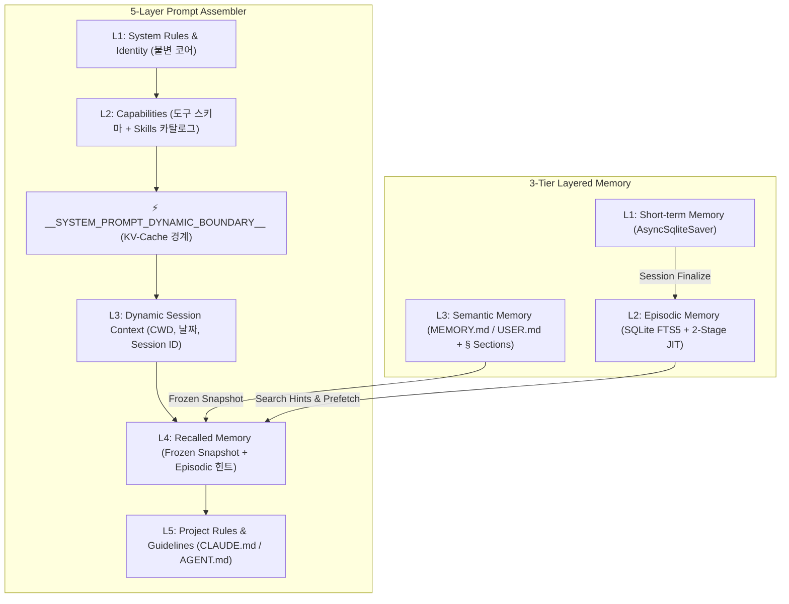

# 🎯 Mission 03. 5계층 프롬프트 조립기 & 계층형 메모리 하네스 (Prompt Assembler & Layered Memory)

> **🎯 목표**: 정적(Static) 시스템 프롬프트의 한계를 극복하고, Claude Code 표준 **5계층 프롬프트 스택(Prompt Assembler)**과 **계층형 메모리(L3 Semantic & L2 Episodic Memory)**를 결합하여 `main_agent`를 고성능 프로덕션 오케스트레이터로 진화시킵니다.
> 
> *(※ 본 미션에서는 `main_agent.py`에 별도의 TODO 주석을 달아두지 않았으므로, 본 가이드의 안내에 따라 필요한 모듈과 코드를 직접 추가해 나갑니다.)*

---

## 📂 실습 대상 파일 안내

| 파일 경로 | 역할 | 실습 내용 |
| :--- | :--- | :--- |
| `app/agents/main_agent.py` | 메인 에이전트 | 5계층 프롬프트 조립기 및 L2/L3 계층형 메모리 결합 (수정 대상) |
| `app/middleware/prompt/` | 프롬프트 미들웨어 | `PromptAssembler`, `SkillPromptBuilder`, `create_prompt_assembler_middleware` |
| `app/middleware/memory/` | 메모리 미들웨어 | `SemanticMemoryStore`, `EpisodicStore`, `MemoryMiddleware` |
| `tests/test_mission03.py` | 자동화 검증 & 시각화 | 스토어 동작 검증 및 **LLM 주입 5-Layer 프롬프트 실물 시각화** |

---

## 💡 핵심 이론: 프롬프트 캐싱과 계층형 메모리 아키텍처



### 1. Claude Code 5-Layer Prompt Stack & Prompt Caching
현대 프론티어 에이전트(Claude Code, OpenAI Swarm 등)는 단일 정적 프롬프트를 쓰지 않고 **5개의 독립된 계층**으로 프롬프트를 조립합니다:

* **[Static Prefix: GPU KV-Cache HIT 🎯]**
  * **Layer 1 (System Identity & Core Role)**: 오케스트레이터의 핵심 정체성, 5-Phase 루프(계획-위임-모니터링-종합-보고), UI 렌더링 태그 규칙 (`SUPERVISOR_SYSTEM_PROMPT`).
  * **Layer 2 (Capabilities: Tools & Skills)**: 바인딩된 도구들의 파라미터 스키마와 `skills/` 카탈로그.
  * **`__SYSTEM_PROMPT_DYNAMIC_BOUNDARY__`**: GPU KV-Cache 경계선. 이 경계선 이전의 L1, L2는 매 턴, 매 세션마다 **바이트 단위로 100% 동일**하게 유지되어 **비용 90% 절감 및 지연 시간 대폭 단축**을 달성합니다.
* **[Dynamic Suffix: 매 턴/세션 가변 영역 ⚡]**
  * **Layer 3 (Dynamic Session Context)**: 현재 날짜(`Current Date`), 작업 디렉토리(`CWD`), 세션 ID, 호스트 OS, 사용자 권한.
  * **Layer 4 (Memory & Dynamic Documents)**: `MemoryMiddleware`가 주입한 Frozen Semantic Memory(`USER.md`, `MEMORY.md`) 및 과거 세션 요약 힌트.
  * **Layer 5 (User & Local Project Rules)**: 로컬 프로젝트 코딩 컨벤션 및 안전 가이드(`AGENT.md`).

---

### 2. 3-Tier Layered Memory 구조
에이전트는 사람의 뇌처럼 세 가지 서로 다른 계층의 메모리를 사용합니다:

| 계층 | 기억 종류 | 저장 매체 | 수명 (Lifecycle) | 주요 역할 |
| :--- | :--- | :--- | :--- | :--- |
| **L1** | 단기 기억 (Short-term) | `AsyncSqliteSaver` (Checkpointer) | 현재 세션/대화 스레드 | 현재 진행 중인 대화 턴의 문맥 유지 |
| **L2** | 에피소드 기억 (Episodic) | `EpisodicStore` (SQLite FTS5) | 영구 보관 (세션 간) | 과거 대화 이력 인덱싱, 유사 작업 검색 및 2-Stage JIT 회상 |
| **L3** | 시맨틱 기억 (Semantic) | `USER.md` / `MEMORY.md` (`§` 분리) | 영구 보관 (파일 기반) | 사용자 성향, 환경 팩트, 프로젝트 컨벤션 영구 기록 |

---

### 3. 세션 종료 인덱싱 (`finalize_session`) & 2-Stage JIT 회상
과거 대화 전체를 시스템 프롬프트에 다 넣으면 토큰이 폭발하고 캐시가 깨집니다. 따라서 **2단계 JIT(Just-In-Time) 회상 패턴**을 적용합니다:

1. **세션 종료 시 인덱싱 (`finalize_session`)**:
   - `after_agent` 훅에서 백그라운드 비동기 데몬(`daemon=True`)으로 실행되어 사용자 응답에는 **0ms 지연**을 줍니다.
   - [1단계: 로컬 단어 추출 (원문 단어 손실 0%)] + [2단계: LLM 핵심 요약 및 한/영 키워드 추출]을 거쳐 SQLite FTS5에 색인합니다.
2. **1단계 검색 (Search)**:
   - 새 세션에서 유저 질문 인입 시 `MemoryMiddleware.before_agent()`가 질문 키워드로 과거 세션을 검색하여 **L4 프롬프트에 1~2줄 요약 힌트만 주입**합니다.
3. **2단계 상세 회상 (Recall)**:
   - 에이전트는 L4의 요약 힌트를 보고, 대화 원문이 꼭 필요한 경우에만 자율적으로 `session_recall(session_id, anchor_message)` 도구를 호출하여 해당 맥락의 대화 원문 슬라이스를 읽어옵니다.

---

## 🛠️ 실습: `app/agents/main_agent.py` 수정 가이드

`main_agent.py` 파일에 아래 단계별 코드를 순서대로 추가/수정합니다.

### 1단계: 메모리 및 프롬프트 미들웨어 임포트 추가
파일 상단에 `SemanticMemoryStore`, `EpisodicStore`, `MemoryMiddleware`, `PromptAssembler`, `SkillPromptBuilder`, `create_prompt_assembler_middleware`를 임포트합니다:

```python
# 기존 임포트 아래에 추가
from app.middleware.memory import SemanticMemoryStore, EpisodicStore, MemoryMiddleware
from app.middleware.prompt import (
    PromptAssembler,
    SkillPromptBuilder,
    create_prompt_assembler_middleware,
)
```

---

### 2단계: L3 Semantic Store & L2 Episodic Store 초기화
`create_agent_executor()` 내부에서 체크포인터(L1) 생성 코드 바로 아래에 L3 및 L2 스토어를 초기화합니다:

```python
    # 4. L3 Semantic Memory Store 초기화 (MEMORY.md / USER.md)
    semantic_store = SemanticMemoryStore(
        memory_dir=db_dir,
        memory_char_limit=4000,
        user_char_limit=2000,
    )
    semantic_store.load_from_disk()

    # 5. L2 Episodic Memory Store 초기화 (과거 세션 대화 + SQLite FTS5 인덱싱)
    episodic_db_dir = "artifacts/memory"
    os.makedirs(episodic_db_dir, exist_ok=True)
    episodic_db_path = os.path.join(episodic_db_dir, "episodic.db")
    episodic_store = EpisodicStore(db_path=episodic_db_path)
    await episodic_store.setup()
```

---

### 3단계: MemoryMiddleware 구성 및 도구 바인딩
스토어를 소유한 `MemoryMiddleware`를 생성하고, 에이전트가 사용할 자율 메모리 도구 2종(`memory`, `session_recall`)을 추출하여 활성 도구 목록에 결합합니다:

```python
    # 6. MemoryMiddleware 구성 (스토어 + memory / session_recall 도구 + 훅)
    memory_mw = MemoryMiddleware(
        semantic_store=semantic_store,
        episodic_store=episodic_store,
        review_llm=llm,
    )
    memory_tools = memory_mw.get_tools()

    # 7. 전체 도구 세트 통합 (Supervisor 14종 + Memory 2종 = 총 16종)
    active_tools = list(tools_supervisor) + list(memory_tools)
```

---

### 4단계: Claude Code 5-Layer Prompt Assembler 조립
스킬 카탈로그 빌더와 5계층 프롬프트 조립기를 구성하고, LangChain AgentMiddleware로 래핑합니다:

```python
    # 8. Claude Code 표준 5-Layer Prompt Assembler 구성
    skill_builder = SkillPromptBuilder(
        skills_dirs=["./skills", "./.agents/skills", "skills", os.path.join(os.getcwd(), "skills")],
        guidelines_path="app/prompts/SKILL.md" if os.path.exists("app/prompts/SKILL.md") else None,
    )

    assembler = PromptAssembler(
        system_rules=SUPERVISOR_SYSTEM_PROMPT,
        tool_schemas=active_tools,
        skill_catalog=skill_builder.assemble,
        l4_docs={},
        agent_rules_path="app/prompts/SKILL.md" if os.path.exists("app/prompts/SKILL.md") else None,
    )
    prompt_mw = create_prompt_assembler_middleware(assembler, merge_system=True)
```

---

### 5단계: 미들웨어 파이프라인 결합 (CRITICAL 순서)
> ⚠️ **순서 주의**: `memory_mw`가 먼저 실행되어야 `recalled_memory` 컨텍스트가 채워지고, `prompt_mw`가 이를 읽어 L4에 주입할 수 있습니다.
```python
    # 9. 통합 미들웨어 파이프라인 (순서 중요: Memory -> Prompt -> Self-Recovery)
    backup_model = os.getenv("FALLBACK_MODEL_NAME", "gemini-2.5-flash")
    middleware = [
        memory_mw,
        prompt_mw,
        ModelFallbackMiddleware(
            max_retries=2,
            initial_delay=0.5,
            fallback_model_name=backup_model
        ),
        ToolErrorHandlerMiddleware(max_retries=0),
        ModelCallLimitMiddleware(run_limit=50, exit_behavior="end"),
    ]
```

---

### 6단계: create_agent 수정 및 인스턴스 참조 보존
`create_agent` 호출 시 `system_prompt` 인자를 제거하고(PromptAssemblerMiddleware가 런타임에 주입), 테스트 검증용 참조 속성들을 보존합니다:

```python
    # 10. 하네스로 결합된 최종 메인 에이전트 인스턴스 구축
    main_agent = create_agent(
        model=llm,
        tools=active_tools,
        middleware=middleware,
        checkpointer=checkpointer,
        context_schema=AgentContext,
    )

    # 리소스 정리 및 검증용 참조 보존
    main_agent.registered_tools = active_tools
    main_agent.checkpointer_conn = conn
    main_agent.episodic_store = episodic_store
    main_agent.semantic_store = semantic_store
    main_agent.assembler = assembler
    main_agent.memory_middleware = memory_mw

    return main_agent
```

---

## 📋 완성된 `main_agent.py` 전체 코드 (참고용)

<details>
<summary><b>👉 완성본 코드 펼치기/접기</b></summary>

```python
import os
import json
import aiosqlite
from langgraph.checkpoint.sqlite.aio import AsyncSqliteSaver
from langchain.agents import create_agent

from app.utils import init_chat_model
from app.utils.context import AgentContext
from app.prompts import SUPERVISOR_SYSTEM_PROMPT
from app.tools import tools_supervisor
from app.middleware.memory import SemanticMemoryStore, EpisodicStore, MemoryMiddleware
from app.middleware.prompt import PromptAssembler, SkillPromptBuilder, create_prompt_assembler_middleware
from app.middleware.error_control.self_recovery import (
    ModelFallbackMiddleware,
    ToolErrorHandlerMiddleware,
    ModelCallLimitMiddleware,
)

AGENT_METADATA = {
    "name": "main_agent",
    "description": "하네스 기능을 연결할 메인 오케스트레이터 에이전트"
}


def _load_config(path: str, default: dict) -> dict:
    try:
        if os.path.exists(path):
            with open(path, "r", encoding="utf-8") as f:
                return json.load(f)
    except Exception:
        pass
    return default


async def create_agent_executor():
    model_cfg = _load_config("./configs/model.config", {
        "model_name": "gemini-3.7-flash",
        "temperature": 0.0,
    })
    llm = init_chat_model(
        model=model_cfg.get("model_name", "gemini-3.7-flash"),
        temperature=model_cfg.get("temperature", 0.0)
    )

    db_dir = "app/database"
    os.makedirs(db_dir, exist_ok=True)
    checkpoints_path = os.path.join(db_dir, "checkpoints.db")

    conn = await aiosqlite.connect(checkpoints_path, check_same_thread=False)
    checkpointer = AsyncSqliteSaver(conn)
    await checkpointer.setup()

    semantic_store = SemanticMemoryStore(
        memory_dir=db_dir,
        memory_char_limit=4000,
        user_char_limit=2000,
    )
    semantic_store.load_from_disk()

    episodic_db_dir = "artifacts/memory"
    os.makedirs(episodic_db_dir, exist_ok=True)
    episodic_db_path = os.path.join(episodic_db_dir, "episodic.db")
    episodic_store = EpisodicStore(db_path=episodic_db_path)
    await episodic_store.setup()

    memory_mw = MemoryMiddleware(
        semantic_store=semantic_store,
        episodic_store=episodic_store,
        review_llm=llm,
    )
    memory_tools = memory_mw.get_tools()
    active_tools = list(tools_supervisor) + list(memory_tools)

    skill_builder = SkillPromptBuilder(
        skills_dirs=["./skills", "./.agents/skills", "skills", os.path.join(os.getcwd(), "skills")],
        guidelines_path="app/prompts/SKILL.md" if os.path.exists("app/prompts/SKILL.md") else None,
    )

    assembler = PromptAssembler(
        system_rules=SUPERVISOR_SYSTEM_PROMPT,
        tool_schemas=active_tools,
        skill_catalog=skill_builder.assemble,
        l4_docs={},
        agent_rules_path="app/prompts/SKILL.md" if os.path.exists("app/prompts/SKILL.md") else None,
    )
    prompt_mw = create_prompt_assembler_middleware(assembler, merge_system=True)

    backup_model = os.getenv("FALLBACK_MODEL_NAME", "gemini-2.5-flash")
    middleware = [
        memory_mw,
        prompt_mw,
        ModelFallbackMiddleware(
            max_retries=2,
            initial_delay=0.5,
            fallback_model_name=backup_model
        ),
        ToolErrorHandlerMiddleware(max_retries=0),
        ModelCallLimitMiddleware(run_limit=50, exit_behavior="end"),
    ]

    main_agent = create_agent(
        model=llm,
        tools=active_tools,
        middleware=middleware,
        checkpointer=checkpointer,
        context_schema=AgentContext,
    )

    main_agent.registered_tools = active_tools
    main_agent.checkpointer_conn = conn
    main_agent.episodic_store = episodic_store
    main_agent.semantic_store = semantic_store
    main_agent.assembler = assembler
    main_agent.memory_middleware = memory_mw

    return main_agent
```
</details>

---

## 🧪 자동화 검증 & 프롬프트 시각화 실행

Codespaces 터미널에서 다음 검증 스크립트를 실행합니다:
```bash
python tests/test_mission03.py
```

### 🎨 시각화 출력 화면:
```text
================================================================================
🧪 [Mission 03] 5-Layer Prompt Assembler & Layered Memory 통합 검증 시작
================================================================================
  ✅ Test 1 통과: Semantic Memory Store 로드 성공 (USER 엔트리: 5개, MEMORY 엔트리: 3개)
  ✅ Test 2 통과: Episodic Store FTS5 인덱싱 및 검색 확인 (검색 적중 세션: session_test_arch)
  ✅ Test 3 통과: main_agent에 메모리 전용 도구(memory, session_recall) 정상 바인딩 (총 16종 도구)
  ✅ Test 4 통과: Claude Code 5-Layer Prompt Assembler 정상 장착 확인

================================================================================
🎨 [실물 시각화] LLM에 런타임 주입되는 5-Layer System Prompt 전문
================================================================================
=== Layer 1: System Identity & Core Role ===
당신은 사용자의 모든 요청을 편안하게 도와드리는 유능한 AI 어시스턴트입니다...

=== Layer 2: Capabilities (Tools & Skills) ===
## 🛠️ Layer 2.1: Registered Tool Capabilities (Alphabetical)
### [1] `enter_plan` ...
### [11] `memory` ...
### [12] `session_recall` ...
__SYSTEM_PROMPT_DYNAMIC_BOUNDARY__

=== Layer 3: Dynamic Session Context ===
Session Information:
- Current Date: 2026-09-03
- Working Directory (CWD): /workspace
- Session ID: current_session_123

=== Layer 4: Memory & Dynamic Documents ===
[Recalled Memory (injected by MemoryMiddleware)]:
• [Semantic Profile]: - **Identity**: Cheolsu Kim (AI Software Engineer)
• [Episodic Hint]: 과거 세션(session_test_arch)에서 Qdrant/FastAPI 아키텍처 논의 완료

=== Layer 5: User & Local Project Rules ===
...
🎉 [Mission 03] 모든 하네스(프롬프트 조립 + 계층형 메모리) 검증 100% 통과!
```

---

## 💬 Chainlit UI 대화 시나리오 테스트

FastAPI 서버(`http://localhost:8000`)와 Chainlit(`http://localhost:8080`)을 띄우고 `main_agent`를 선택한 뒤 아래 시나리오를 테스트합니다.

### 🎭 시나리오 1. Semantic Memory 자율 기록 및 개인화 QA
1. **사용자 입력**:
   ```text
   내 직업은 5년차 AI 소프트웨어 엔지니어이고, 주로 Python과 LangGraph를 다뤄. 이 사실을 기억해줘.
   ```
2. **동작 확인**:
   - 에이전트가 `memory(action="add", target="user", content="Identity: 5-year AI Software Engineer specializing in Python and LangGraph")` 도구를 호출하는지 확인.
   - `app/database/USER.md` 파일에 해당 내용이 `§` 구분자로 즉시 추가되었는지 확인.
3. **후속 질문**:
   ```text
   내가 주로 어떤 언어와 프레임워크를 다룬다고 했지?
   ```
   - 에이전트가 기억된 프로필을 바탕으로 정확하게 답변하는지 확인.

---

### 🎭 시나리오 2. 과거 세션 회상 (Episodic Memory & 2-Stage JIT Recall)

이 시나리오는 서로 다른 대화 세션 간에 에이전트가 어떻게 과거 대화를 기억하고, **환각(Hallucination) 없이 도구(`session_recall`)를 스스로 꺼내 완벽하게 회상하는지**를 검증합니다.

#### 1단계: 첫 번째 대화방 (세션 1) — 주제 논의 및 백그라운드 자동 인덱싱
1. **사용자 입력**:
   ```text
   우리는 이번 대화에서 금융의 미래에 대해 논의하고 싶어. 금융에서 블록체인은 얼마나 중요해질까?
   ```
2. **동작 관찰**:
   - 에이전트가 레거시 금융 vs 블록체인 차세대 금융 아키텍처(T+0 원자적 정산, RWA 토큰화, 스마트 컨트랙트 등)를 깊이 있게 브리핑합니다.
   - 응답이 끝나는 즉시 `after_agent` 훅이 발동되어, **백그라운드 데몬 스레드에서 조용히 `finalize_session`을 실행**합니다.
   - 대화 원문과 요약, 그리고 한/영 이중 키워드(`블록체인`, `금융의 미래`, `T+0`, `RWA` 등)가 SQLite FTS5(`artifacts/memory/episodic.db`)에 영구 색인됩니다 (유저 대기 시간 0ms).

---

#### 2단계: 두 번째 대화방 (세션 2) — 완전히 새로운 방에서 JIT 세션 회상
1. Chainlit 좌측 상단의 **`New Chat` (+ 아이콘)** 버튼을 눌러 이전 대화 기록이 전혀 없는 완전히 새로운 대화방을 엽니다.
2. **사용자 입력**:
   ```text
   이전에 금융의 미래에 대해 논의했던 거 기억해? 내가 뭘 물어봤고 너가 어떻게 대답했어?
   ```
3. **관찰 포인트 (✨ 킬러 기능)**:
   - Chainlit UI 스텝 화면에 **`🛠️ session_recall` 도구 호출 박스**가 나타나는지 확인합니다!
   - **무대 뒤 동작 원리**:
     1. `before_agent` 훅이 유저 질문("금융의 미래")으로 FTS5를 고속 검색하여 직전 세션 요약 힌트를 프롬프트 Layer 4에 주입합니다.
     2. LLM이 힌트를 보고 *"구체적인 질문/답변 원문이 필요하다"*고 스스로 판단하여 `session_recall` 도구를 자율 호출합니다.
     3. 일반 AI처럼 "기억나지 않습니다"라고 거절하거나 지어내는(환각) 대신, **당시 질문 원문과 답변 요약(T+0 정산, RWA 등)을 100% 팩트 기반으로 완벽하게 복원**하여 대답합니다.

---

## 🏆 Mission 03 완료 체크리스트

- [ ] `PromptAssembler`와 `create_prompt_assembler_middleware`를 통해 5계층 프롬프트 시스템을 구축했다.
- [ ] L1~L2 정적 프리픽스와 L3~L5 동적 컨텍스트 사이의 GPU KV-Cache 경계선(`__SYSTEM_PROMPT_DYNAMIC_BOUNDARY__`)을 이해했다.
- [ ] `SemanticMemoryStore`로 영구 규칙/프로필(`USER.md`, `MEMORY.md`)을 로드하고 프롬프트 L4에 주입했다.
- [ ] `EpisodicStore`와 `MemoryMiddleware`를 통해 대화 종료 시 자동 색인(`finalize_session`) 및 대화 중 인출(`session_recall`) 2단계 JIT 메모리를 완성했다.
- [ ] `python tests/test_mission03.py`를 실행하여 4개 테스트 통과 및 5-Layer 실물 프롬프트 시각화를 확인했다.
- [ ] Chainlit UI에서 Semantic 기억 QA 및 세션 간 Episodic 회상 대화를 성공적으로 검증했다.
